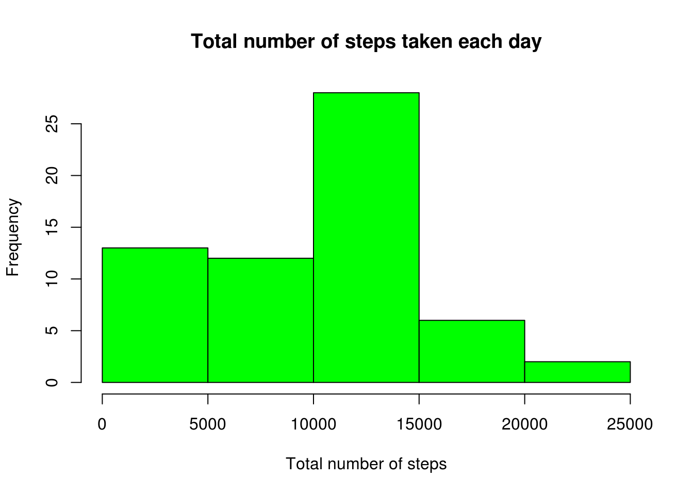
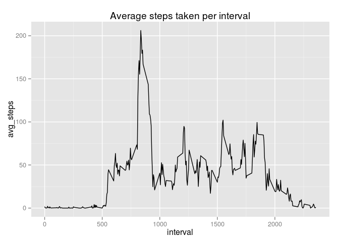
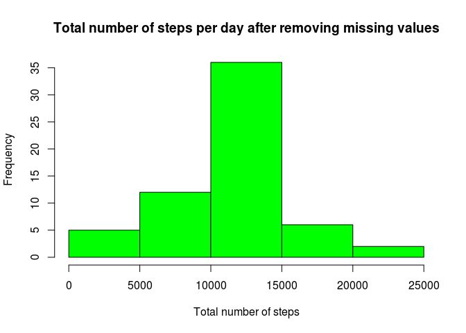
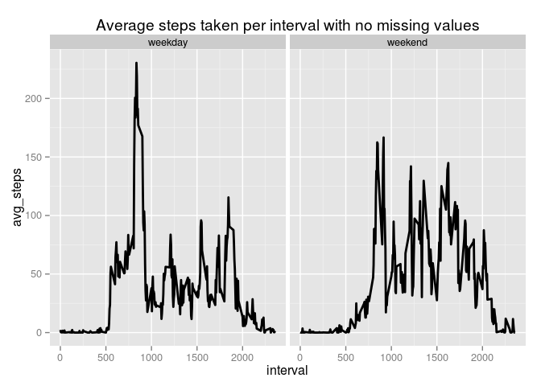

# Reproducible Research: Peer Assessment 1


## Loading and preprocessing the data


```r
#Load the data 
unzip("activity.zip")
data <- read.csv("activity.csv")

#Process/transform the data (if necessary) into a format suitable for your analysis
data$date <- as.Date(data$date)
```

## What is mean total number of steps taken per day?


```r
# Calculate the total number of steps taken per day. Missing values can be ignored.
total_steps_per_day <- aggregate(x = data$steps , by = list(data$date), FUN = sum ,na.rm=TRUE)
colnames(total_steps_per_day) <- c("date","steps")
total_steps_per_day$steps <- as.numeric(total_steps_per_day$steps)

# Create a histogram of the total number of steps taken each day.
hist(total_steps_per_day$steps, col = "green", main = paste("Total number of steps taken each day"), xlab = "Total number of steps")
```

 

```r
# Calculate and report the mean of the total number of steps taken per day
mean(total_steps_per_day$steps)
```

```
## [1] 9354.23
```

```r
# Calculate and report the median of the total number of steps taken per day
median(total_steps_per_day$steps)
```

```
## [1] 10395
```

## What is the average daily activity pattern? 

```r
# Time series plot of 5-minute interval and the average number of steps taken, averaged across all days
avg_steps_by_interval  <- aggregate(x = data$steps , by = list(data$interval), FUN = mean , na.rm=TRUE) 
colnames(avg_steps_by_interval) <- c("interval","avg_steps")

ggplot(avg_steps_by_interval,aes(interval,avg_steps)) +
                 ggtitle("Average steps taken per interval") +
                 geom_line()
```

 

```r
#Which 5-minute interval contains the maximum number of steps?
avg_steps_by_interval[which.max(avg_steps_by_interval$avg_steps),c("interval")]
```

```
## [1] 835
```
## Imputing missing values

```r
# Calculate and report the total number of missing values in the dataset
sum(is.na(data$steps))
```

```
## [1] 2304
```

```r
# Where there are missing values in my dataset, I will replace them with the mean for that interval 
clean_data <- merge(data,avg_steps_by_interval, by = "interval", all.x = TRUE)
clean_data[is.na(clean_data$steps),c("steps")] <- clean_data[is.na(clean_data$steps),c("avg_steps")]

# drop the avg_steps column now as it's no longer needed 
clean_data$avg_steps <- NULL

# order the merged data by the date field and finally swap the columsn around to preserve the original look 
order_date <- order(clean_data$date)
clean_data <- clean_data[order_date, ]
clean_data <- clean_data[c("steps", "date", "interval")]

# Now we can recalculate mean and median, and show a histogram of the total number of steps taken each day from the new dataset 
total_steps_per_day2 <- aggregate(x = clean_data$steps , by = list(data$date), FUN = sum ,na.rm=TRUE)
colnames(total_steps_per_day2) <- c("date","steps")
total_steps_per_day2$steps <- as.numeric(total_steps_per_day2$steps)

# Create a histogram of the total number of steps taken each day.
hist(total_steps_per_day2$steps, col = "green", main = paste("Total number of steps per day after removing missing values"), xlab = "Total number of steps")
```

 

```r
# Calculate and report the mean of the total number of steps taken per day
mean(total_steps_per_day2$steps)
```

```
## [1] 10766.19
```

```r
# Calculate and report the median of the total number of steps taken per day
median(total_steps_per_day2$steps)
```

```
## [1] 10766.19
```

```r
# Mean and Median values now match: with the strategy we adopted for filling in
# missing values we have "normalized" our distribution.
```
## Are there differences in activity patterns between weekdays and weekends? 

```r
# Add a variable to the dataset to indicate whether a given date is a weekday or weekend day.
clean_data$weekday <- as.factor(ifelse(weekdays(clean_data$date) %in% c("Saturday","Sunday"), "weekend", "weekday"))

avg_steps_by_interval_weekdays <- aggregate(x = clean_data$steps , by = list(clean_data$interval,clean_data$weekday), FUN = mean , na.rm=TRUE) 
colnames(avg_steps_by_interval_weekdays) <- c("interval","weekday","avg_steps")

ggplot(avg_steps_by_interval_weekdays,aes(interval,avg_steps)) + 
    ggtitle("Average steps taken per interval with no missing values") + 
    facet_grid(. ~ weekday) + 
    geom_line(size=1) 
```

 

```r
# From the differences between the two plots, it would seem that users tend to
# to be more active at weekends. During week days they seem to be very active 
# for a short time at the beginning of the day - perhaps while commuting to work 
# or going for a workout in the morning - and less active for the rest of the day
```
